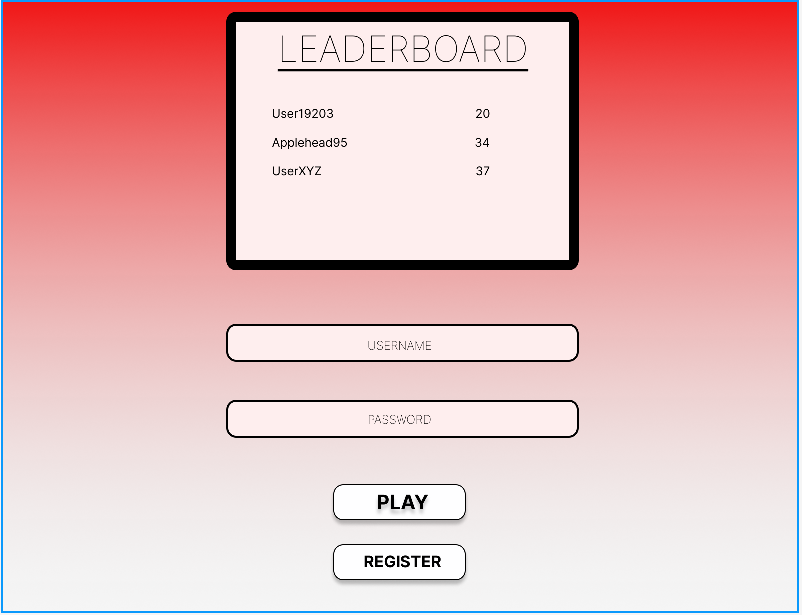
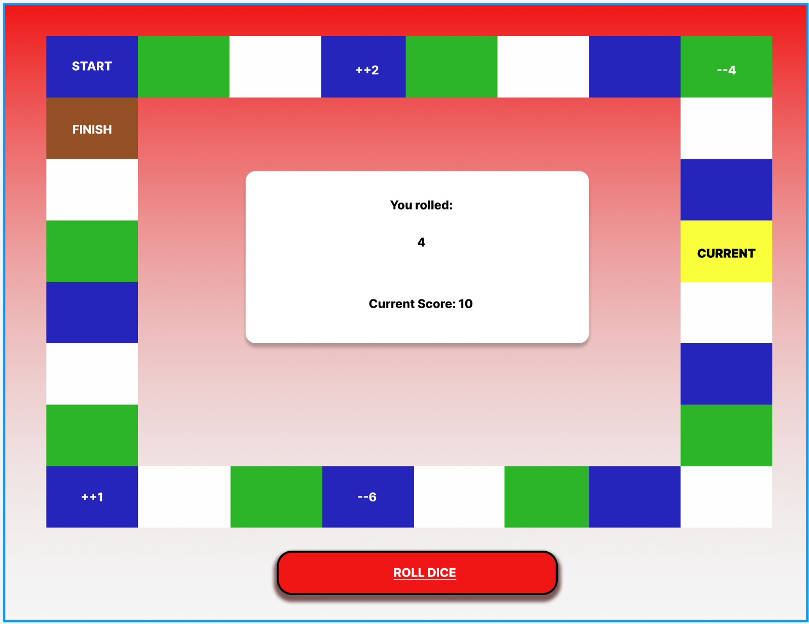
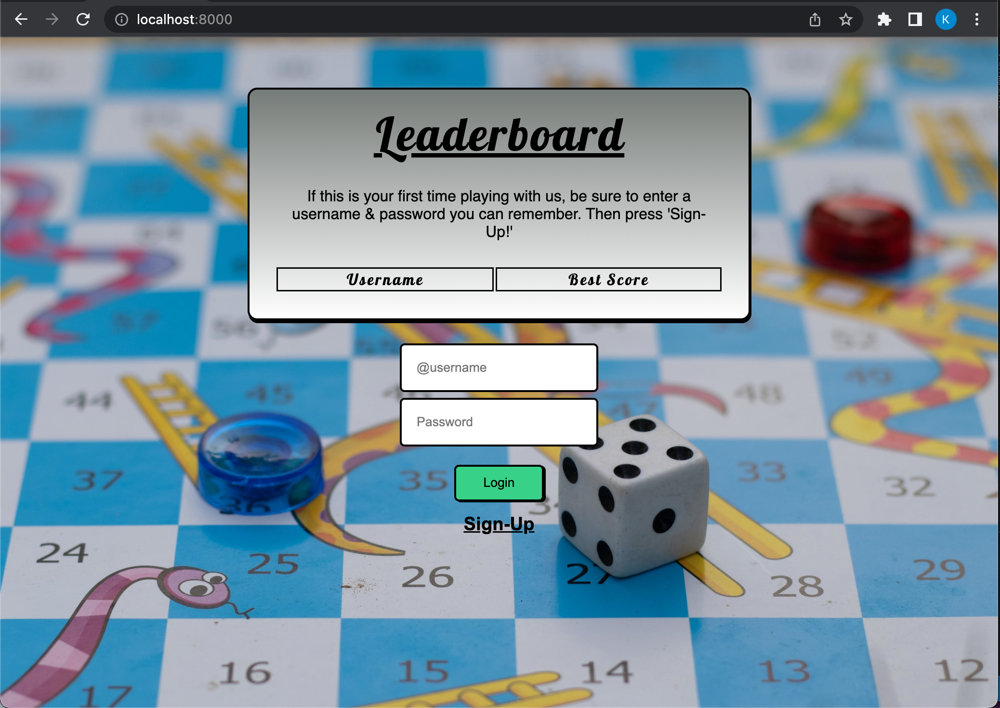
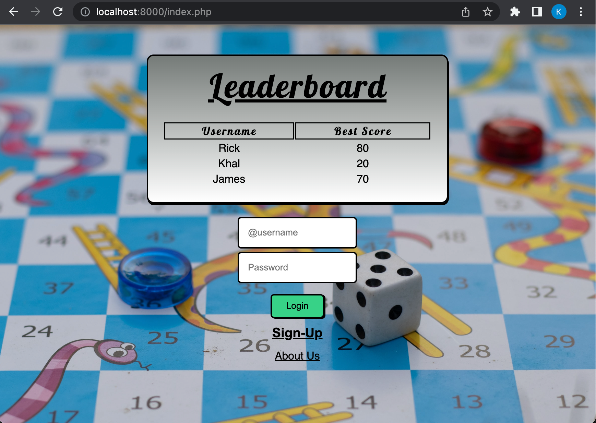

# POPULAR DICE GAME

### (WP-Project 1)

#### This a game where users can roll a virtual dice to determine the ammount of spaces to move forward. The users score is determined off of the total number of "moves" accrued from rolling the before mentioned dice.

## Khalfani's Agenda:

- ~~Verify this idea falls into the category of "popular dice games" with the instructor~~
- ~~Create figma model of project~~
  ~~~~
  ~~~~

- ~~make database in session storage for {username, passwords} and for {username, bestscore}~~
  ~~https://youtu.be/0vshwYT7xUE~~

- ~~Improve visual aspect of login page~~
  ~~https://youtu.be/JplnuNFZ9CE~~
  
- ~~make the leaderboard functional (waiting for game to playable enough to collect points)~~
  
- ~~Make powerpoint with required features so that Ruchitha can make youtube presentation with it~~
https://docs.google.com/presentation/d/13Fzw2C8OdEkJixIP_EJCwKRubnrHJi6HJyYmdRxGh4M/edit?usp=sharing

