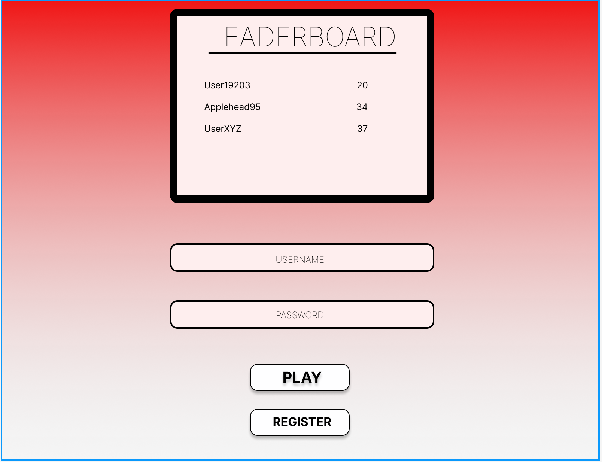
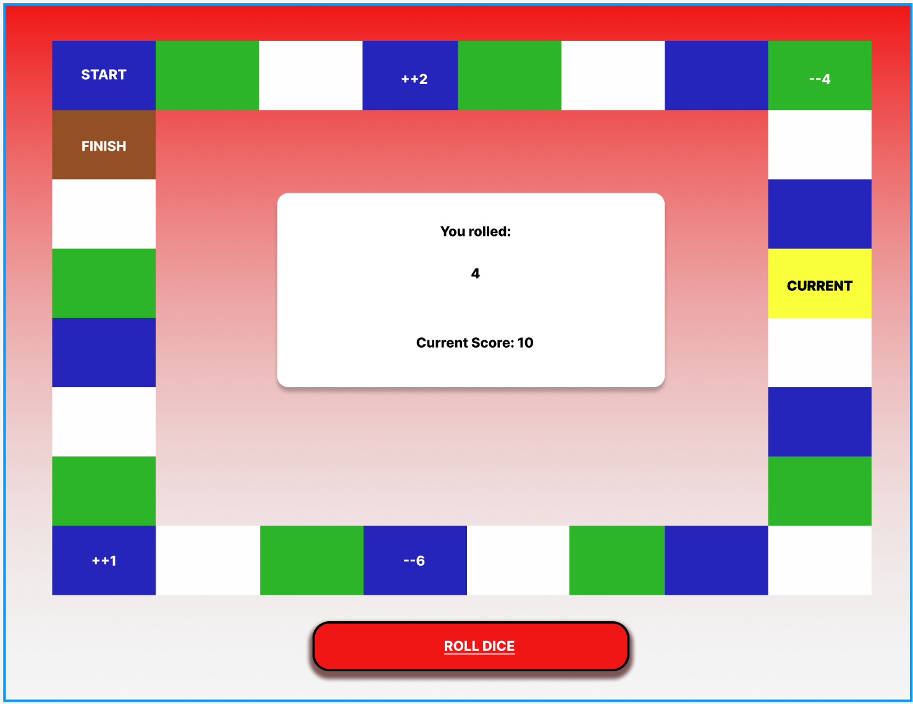

# WP--Project1--DiceGame

## This a game where users can virtually role a dice to determine the ammount of spaces to move forward. The users score is determined off of the total number of "moves" accrued from the rolling of said dice.

### Khalfani's Agenda:

- ~~Verify this idea falls into the category of "popular dice games" with the instructor~~
- ~~Create figma model of project~~
  ~~~~
  ~~~~

- ~~make database in session storage for {username, passwords} and for {username, bestscore}~~
  ~~https://youtu.be/0vshwYT7xUE~~

- Improve visual aspect of login page

- make the leaderboard functional (waiting for game to playable enough to collect a point)

- make youtube video based on the powerpoint (waiting for powerpoint)
